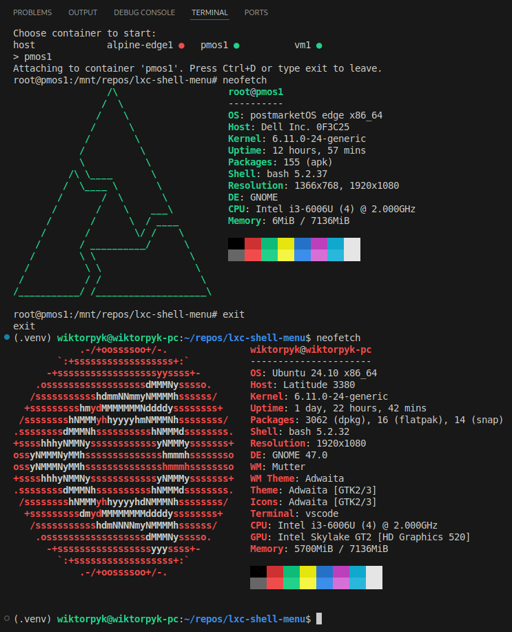

# LXC Shell Menu

A convenient interactive menu for starting LXC containers when opening a new terminal window.



## Installation

```bash
git clone https://github.com/wiktorpp/lxc-shell-menu
cd lxc-shell-menu
python3 lxc-shell-menu.py --install
```

## Usage

After installation, open a new terminal window. The menu will display a list of available LXC containers:

```
wiktorpyk-pc login: wiktorpyk
Password: 
Choose container to start:
host              vm1               vm2               vm3
vm1
Attaching to container 'vm1'. Press Ctrl+D or type exit to leave.
root@vm1:/# exit
exit
wiktorpyk@wiktorpyk-pc:~$ 
```